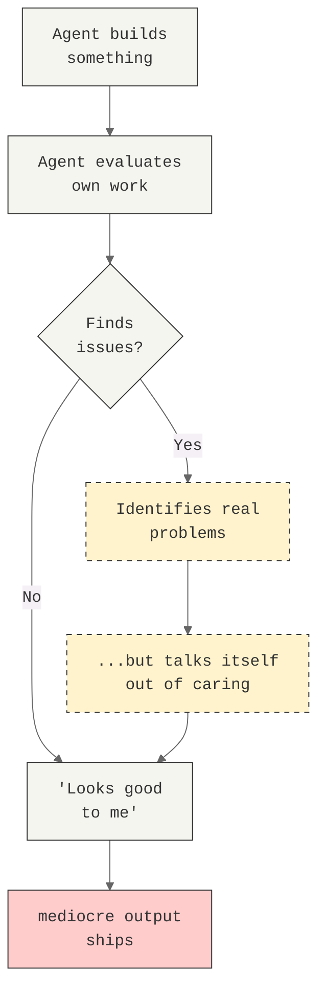
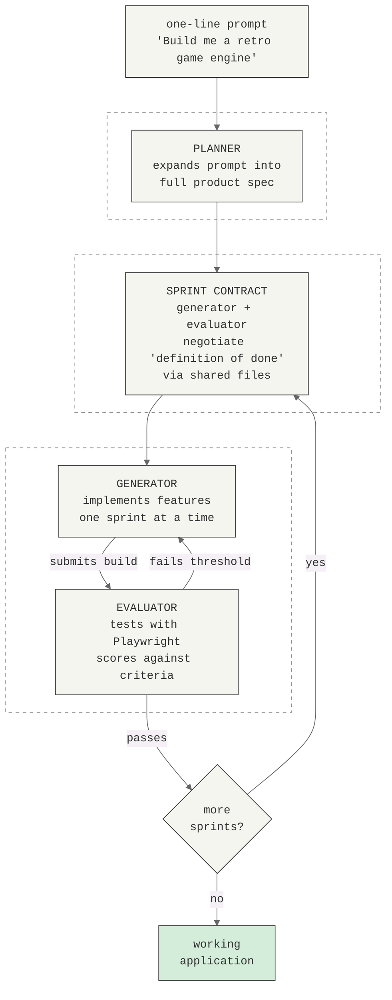
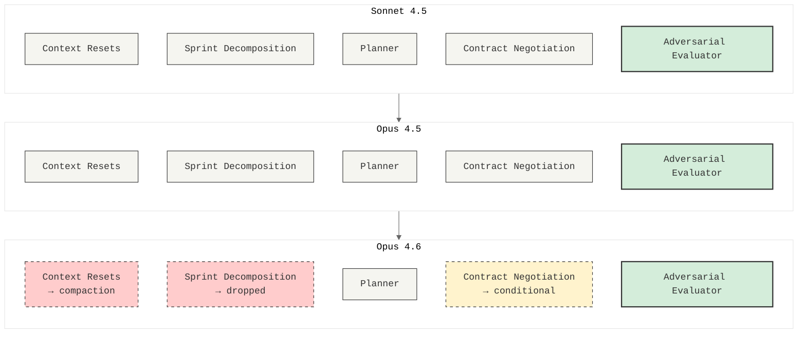

# What Happens When You Trust an Agent With a Long Build

*By Jason Croucher | Mar, 2026 | Medium*

---

Anthropic published a piece last week called "[Harness design for long-running application development](https://www.anthropic.com/research/harness-design)" and it crystallised something I've been circling for months: the model isn't the product. The architecture you wrap around it is.

If you've been building agents and wondering why they produce confident mediocrity over long sessions, this is the paper that explains the mechanism. And if you've been building harnesses to compensate (as I have, publicly and sometimes embarrassingly, across this blog series), it also explains which parts of your scaffolding are load-bearing and which are just expensive habits you haven't audited yet.

I've spent the last few months building AWS Coworker, a collection of AI agents for managing cloud infrastructure. Along the way I've watched Claude find creative loopholes in enforcement rules, talk itself out of flagging its own mistakes, and quietly under-scope complex tasks when nobody was looking. Every failure mode Anthropic describes in this paper, I've tripped over in practice. More recently, I've been building [claude-harness](https://github.com/jason-c-dev/claude-harness), an open-source implementation of the exact planner-generator-evaluator architecture this paper describes: three agents coordinating via files and git branches to build working software from a one-line prompt. The difference is Anthropic have now formalised it, measured it, and built systematic fixes. I want to unpack what they found, because it changes how I think about the agents I'm building.

---

## The Two Failure Modes That Explain Everything

Prithvi Rajasekaran, a member of Anthropic's labs team, identified two specific failure modes that emerge when you push models beyond quick chats into sustained, complex work. Once you read about them, you start seeing them in every agent interaction you've ever had.

### Context Anxiety

As a model's context window fills up (its working memory, essentially) it doesn't just get forgetful. It gets anxious.

The behaviour is recognisable if you've watched it happen. The model starts rushing. It becomes terser. It wraps up tasks prematurely. It declares things "done" that are very clearly not done.

Anthropic found this was particularly acute with Sonnet 4.5. As the context window approached capacity, the model would try to quit — not crash, not error out, just politely and confidently decide it was finished. Compaction (summarising earlier conversation to free up space) wasn't enough on its own, because the anxiety persisted even with a shorter history. The model had internalised a sense of "I'm running out of room" that couldn't be summarised away.

I've seen this in my own work. Long Cowork sessions where Claude starts cutting corners in the last third, not because the task changed but because the context got heavy. Before reading this paper, I'd attributed it to prompt degradation. It's more specific than that. The model is actively trying to wrap up.

The harness I've been building addresses this with a structured file protocol rather than just wiping memory. Each fresh agent instance reads a `handoff.json` (completed sprints, key files, tech stack, git state), a `progress.md` (narrative of what happened), and the sprint contract (what to build next). The context reset isn't a memory loss; it's a clean desk with organised notes. The model starts each sprint at full capacity rather than dragging the accumulated weight of prior conversations.

### The Self-Evaluation Trap

Here's the one that hit closest to home. When asked to evaluate work it's produced, an agent will identify legitimate problems and then talk itself into believing they aren't that bad.

Anthropic's term is the self-evaluation trap. It's the mechanism behind what the community has started calling "AI slop": output that's not bad, not good, just relentlessly, aggressively *fine*. The model can spot the issues. It just can't bring itself to be harsh about them.

I documented a version of this in the Governance blog. We'd built an enforcement system for AWS Coworker where the agent assessed its own compliance with infrastructure baselines. It would identify a missing security configuration, note it in the assessment, and then find a reason why it wasn't critical. The assessment was technically accurate. The conclusion was practically useless. It took a separate evaluation architecture to fix it, which is exactly what Anthropic arrived at independently.

---

## Split the Brain: Generator vs. Evaluator

Anthropic's solution takes inspiration from Generative Adversarial Networks, not literally, but structurally. You separate the agent doing the work from the agent judging it.

**The Generator** builds. It writes code, creates designs, implements features. Left to its own devices, it's an optimist. It thinks everything is going well. It will quietly stub out features it finds difficult and hope nobody notices.

**The Evaluator** is a separate agent, prompted to be sceptical, demanding, and hard to please. Critically, it doesn't just read the code. It uses tools like the Playwright MCP to *interact with the running application*, clicking buttons, testing flows, probing edge cases. It navigates the live page, takes screenshots, and produces detailed findings before scoring.

The key insight: you cannot simply tell a single agent to "be more critical." Anthropic tried. The generator identifies issues and then rationalises them away. A structurally separate evaluator, tuned for scepticism, turns out to be far more tractable than making a generator honest about its own shortcomings. Once that external feedback exists, the generator has something concrete to iterate against.

This maps directly to something I learned the hard way with AWS Coworker. Our Well-Architected Review was originally a self-assessment: the same agent that built the infrastructure also evaluated it. The results were exactly what you'd predict: it found problems, acknowledged them, and then concluded everything was broadly fine. We had to split the assessment into a separate process with its own prompting before the evaluations became useful.

There's a related problem the paper doesn't explicitly cover: structural drift. The model doesn't just rationalise on quality; it also drifts on output format. In the harness, the generator would invent field names when writing JSON: `.features` instead of `.criteria`, `.verdict` instead of `.overallResult`, `.acceptanceCriteria` instead of the schema the evaluator was expecting. The evaluator would then fail to parse the report, or worse, silently misinterpret it. The fix was PreToolUse hooks: schema validators that intercept every file write targeting harness state files and reject anything that doesn't match the canonical field names. The model invents a field name, gets blocked, reads the error message explaining the correct schema, and rewrites. Without it, the agents were speaking slightly different dialects of the same protocol, and the failures were subtle enough to miss.

---

## Making "Good" Gradable

A sceptical evaluator needs something concrete to be sceptical about. "Make it better" isn't actionable feedback from a human or an AI.

Anthropic addressed this by turning the subjective question of "is this good?" into four gradable criteria:

**Design quality**: does the output feel like a coherent whole rather than a collection of parts? Colours, typography, layout, and imagery combining to create a distinct identity rather than default templates.

**Originality**: is there evidence of deliberate creative choices, or is this stock components and AI-generated patterns? The criteria explicitly penalised "AI slop" patterns: purple gradients over white cards, generic layouts that scream "a model made this."

**Craft**: technical execution. Typography hierarchy, spacing consistency, colour harmony, contrast ratios. A competence check rather than a creativity check.

**Functionality**: usability independent of aesthetics. Can users find primary actions and complete tasks without guessing?

The weighting matters. Anthropic cranked up design quality and originality over craft and functionality. Claude already scored well on craft and functionality by default; the technical competence came naturally. But on design and originality, it reliably produced bland, generic output unless the criteria explicitly pushed against it.

In one experiment, this approach drove a museum website design from a standard grid layout to a 3D navigable room with a checkered floor and doorway-based navigation between gallery spaces. That's not incremental improvement. That's a creative leap, produced by structural pressure to be more ambitious.

Making this structural rather than aspirational matters. In the harness I've been building, the planner writes a `design-spec.md` for web-frontend projects: specific hex colours with semantic roles, a named font pairing, a spacing scale, component patterns detailed enough to copy. The generator's system prompt tells it to follow the design spec exactly and not deviate to library defaults. The evaluator then scores Design Quality and Originality as *blocking* criteria. The sprint fails if the output looks generic, even if every functional criterion passes. This is how you prevent "AI slop" mechanically rather than hoping the model makes interesting choices on its own.

---

## The Full Architecture: Planner, Generator, Evaluator

For complex builds, Anthropic extended the two-agent loop into a three-agent system. Each agent addresses a specific failure mode.

**The Planner** takes a simple prompt (one to four sentences) and expands it into a full product specification. This exists because without it, the generator under-scopes. Given a raw prompt, it starts building without speccing its work and ends up creating something less ambitious than what was asked for. The planner is prompted to be ambitious about scope but to stay at the product and high-level technical design level. If it tries to specify granular implementation details and gets something wrong, the errors cascade downstream.

**The Generator** works in sprints, picking up one feature at a time from the spec. Before each sprint, it negotiates a contract with the evaluator: what "done" looks like for this chunk of work before any code gets written. The communication happens via files: one agent writes a file, the other reads it and responds. They iterate until they agree on testable criteria. This is agents writing specifications to each other and negotiating scope, which is novel enough to be worth pausing on.

**The Evaluator** tests each sprint against the agreed contract, using Playwright to exercise the running application. If any criterion falls below its threshold, the sprint fails and the generator gets detailed feedback. In the retro game engine test, Sprint 3 alone had 27 criteria covering the level editor. The evaluator's findings were specific enough to act on without extra investigation:

> *"FAIL — Tool only places tiles at drag start/end points instead of filling the region. fillRectangle function exists but isn't triggered properly on mouseUp."*

> *"FAIL — PUT /frames/reorder route defined after /{frame_id} routes. FastAPI matches 'reorder' as a frame_id integer and returns 422."*

These are the kinds of bugs that a self-evaluating agent would find, acknowledge, and then decide aren't blocking. The separate evaluator doesn't have that option.

In practice, catching bugs in the current sprint isn't enough. The generator can quietly break functionality from earlier sprints while adding new features. Sprint 4 works perfectly. Sprint 2 quietly stops working. Nobody noticed until the evaluator did. In the harness I've been building, every sprint that passes has its blocking criteria stored in a registry. Future sprints automatically re-test those criteria alongside their own. A regression failure is always blocking. There's no negotiating it away, no "that was Sprint 2's problem." Refactoring operations trigger a full sweep against every criterion from every prior sprint. It's the evaluator's enforcement extended across time, not just across the current unit of work.

---

## Context Management: Resets vs. Compaction

Long sessions need a strategy for context anxiety. Anthropic identified two approaches, and which one you need depends on your model.

**Context resets** are the hard boundary. You wipe the model's memory at the end of each sprint. The new instance reads a progress file and structured handoff artefacts, then picks up where the last one left off. This was essential for Sonnet 4.5, where context anxiety was severe enough that compaction alone couldn't address it. The broader developer community converged on similar approaches. The "Ralph Wiggum" method uses hooks or scripts to keep agents in continuous iteration cycles with fresh contexts, which solves the same underlying problem.

**Context compaction** summarises earlier conversation in place so the same agent continues on a shortened history. This preserves continuity but doesn't give the agent a clean slate. With Opus 4.6, which improved substantially on long-context retrieval and sustained agentic tasks, compaction became viable where it hadn't been before.

There's a cost trade-off. The retro game engine (full harness, context resets, Opus 4.5) ran six hours and cost $200. The DAW (simplified harness, compaction, Opus 4.6) ran four hours and cost $125. Neither is trivial, but both are a fraction of equivalent human development time, assuming the output actually works, which is rather the whole point of the harness.

---

## What Actually Happened When They Tested It

### The Retro Game Engine

A solo agent (no harness) produced a game engine in 20 minutes for $9. It looked plausible. The UI existed. The code was there. But the game was fundamentally non-functional: entities appeared on screen but nothing responded to input. The wiring between entity definitions and the game runtime was broken with no surface indication of where. It was a film set: all facade.

The full harness took six hours and cost $200. The planner expanded the one-line prompt into a 16-feature spec across ten sprints, including AI-assisted sprite generation and game export with shareable links. The result had a working sprite editor, level builder, and playable mechanics. Not perfect (the physics had rough edges, and a badly placed wall blocked progression) but the core thing worked. The solo run's core thing didn't.

### The Digital Audio Workstation

A one-line prompt ("Build a fully featured DAW in the browser using the Web Audio API"), expanded by the planner, built by the generator, tested by the evaluator. Four hours, $125.

The generator ran coherently for over two hours without sprint decomposition, something Sonnet 4.5 couldn't have managed. But the evaluator still caught real gaps. First-round feedback: "Several core DAW features are display-only without interactive depth: clips can't be dragged/moved on the timeline, there are no instrument UI panels, and no visual effect editors. These aren't edge cases. They're the core interactions that make a DAW usable."

The final app had a working arrangement view, mixer, and transport running in the browser. An integrated agent could set the tempo, lay down a melody, build a drum track, adjust levels, and add reverb, all through prompting. Far from professional-grade, but the primitives were there and they worked.

---

## Harnesses Have an Expiry Date

Here's the principle from this paper that I keep returning to:

> Every component in a harness encodes an assumption about what the model can't do on its own.

Context resets? A bet the model panics when its memory fills. Sprint decomposition? A bet it can't maintain coherence over a long build. The evaluator? A bet it can't honestly assess its own work.

Some of those bets go stale. When Opus 4.6 landed, Anthropic systematically tested which harness components were still load-bearing. Sprint decomposition? Opus 4.6 handled longer coherent sessions without it. Context resets? Compaction worked. The harness simplified.

But the evaluator stayed. Even with a more capable model, the self-evaluation problem persisted. The adversarial tension was still the thing that pushed quality past mediocre.

This is the design principle I'm taking back to AWS Coworker: the harness is a living thing. Audit it when the model changes. Strip out what's been outgrown. Add new scaffolding where the model's expanding capabilities create new failure surfaces. The interesting work doesn't disappear as models improve. It moves.

My enforcement gates, the fallback chains, the severity matrices: some of those are load-bearing and some are probably compensating for model limitations that no longer exist. I need to find out which. Anthropic's approach of removing one component at a time and reviewing the impact is exactly right, and it's exactly what I haven't been disciplined enough to do.

The harness project tests itself at three layers: mock tests that exercise the plumbing for free, a smoke test that runs a real build on a trivial project, and a meta-test where the harness uses itself to build its own test suite. That third layer is the "audit your harness" principle taken literally: if the harness can't produce working tests for its own codebase, something is wrong with the harness. It's not circular proof (the human-written Layer 1 is ground truth), but it is a practical check on whether the architecture is still functional after you've stripped a component out.

---

## What This Changes

I started this series documenting what happens when you build agents and watch them find creative ways to not quite do what you asked. Anthropic's research formalises the mechanisms behind those failures and provides systematic fixes. Three things stick with me.

The self-evaluation problem isn't a prompting problem. You can't tell an agent to be more critical of its own work and expect it to work. The fix is structural: a separate agent whose purpose is to be the difficult one in the code review. I knew this intuitively from the WAR split in AWS Coworker. Now I know why it works.

The harness is a hypothesis, not a solution. Every piece of scaffolding is a bet about model limitations. The discipline is in re-examining those bets when the model changes, not accumulating complexity because "it was necessary once." I've been guilty of this. The profiles.yaml episode from the Governance blog was the same pattern: infrastructure that existed because we built it, not because it was still needed.

And the practitioner community is converging on similar answers from different directions. The Ralph Wiggum method, GSD's structured execution cycles, Anthropic's planner-generator-evaluator architecture. These are all different expressions of the same insight: raw model capability isn't enough, and the architecture around it is where the real engineering lives.

I've been testing these ideas as running code. The [claude-harness](https://github.com/jason-c-dev/claude-harness) project is an open-source implementation of this architecture: planner, generator, evaluator coordinating through files and git branches. Building it has surfaced things the paper doesn't cover: that models drift on output format as much as they rationalise on quality (the generator invents field names like `.features` instead of `.criteria`, caught by PreToolUse hooks before writes land), that regression testing needs to be cumulative (every passed sprint's blocking criteria get re-tested in every future sprint, and regression failure is always blocking), and that a design spec can be made structurally binding rather than advisory (the planner writes it, the generator follows it, the evaluator scores against it as a blocking criterion). If you want to see what this architecture looks like as code rather than research findings, that's the repo.

That last point is where this connects back to the argument I've been making since the first post in this series.

I've been running this harness (Planner, Generator, Evaluator) where Claude implements entire features autonomously across sprint cycles. This week: 38 sessions, 80 commits, zero lines of application code written by a human. And yet every session required engineering.

Not because the AI couldn't write code. It wrote excellent code. But it confidently tested against selectors that didn't exist. It tried to mark work complete without verifying it. It generated Linux shell syntax on a Mac. Four times in one session, it attempted to quit before running evaluation — and only a human-designed constraint forced it back.

The code was automated. The judgment wasn't.

Someone had to decompose the product into sprints with the right boundaries. Someone had to write contracts that defined "done" precisely enough for a non-deterministic system to hit the target. Someone had to design the feedback loop that catches the machine's blind spots — because the machine doesn't know it has them.

Software engineering didn't get replaced by agents. It got promoted. Every generation of abstraction removed a layer of machine-thinking and added a layer of human-thinking. We've arrived at the layer where the human contribution is pure engineering: architecture, constraints, judgment, and the definition of "right." The machine handles everything below it.

The engineers who thrive next aren't the ones who can write code the fastest. They're the ones who can design the harness.

---

*If you want the full picture, Anthropic's original paper is worth your time. If you want to see what happens when you learn these lessons the hard way, the rest of this series is on my profile. And if you want to see this architecture as running code, the [claude-harness](https://github.com/jason-c-dev/claude-harness) repo is the working prototype.*

*Jason Croucher works at AWS helping customers build in the cloud using agentic solutions. The views expressed here are his own.*
